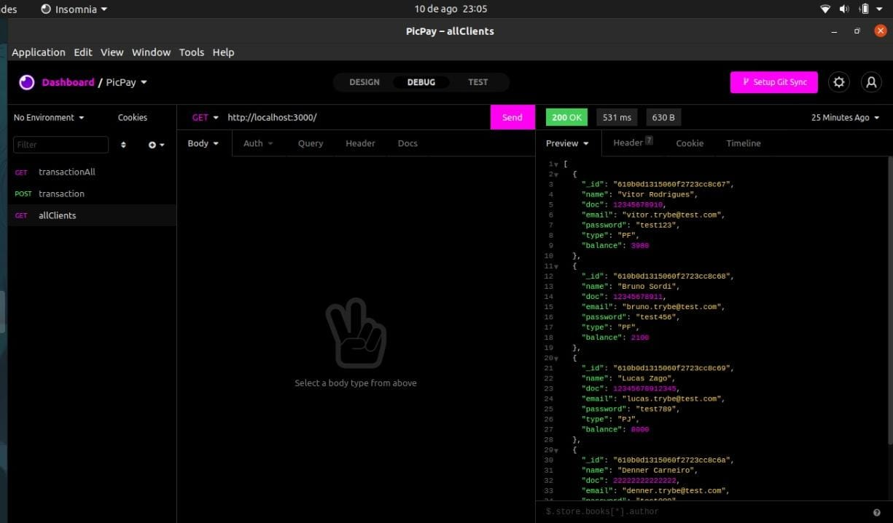
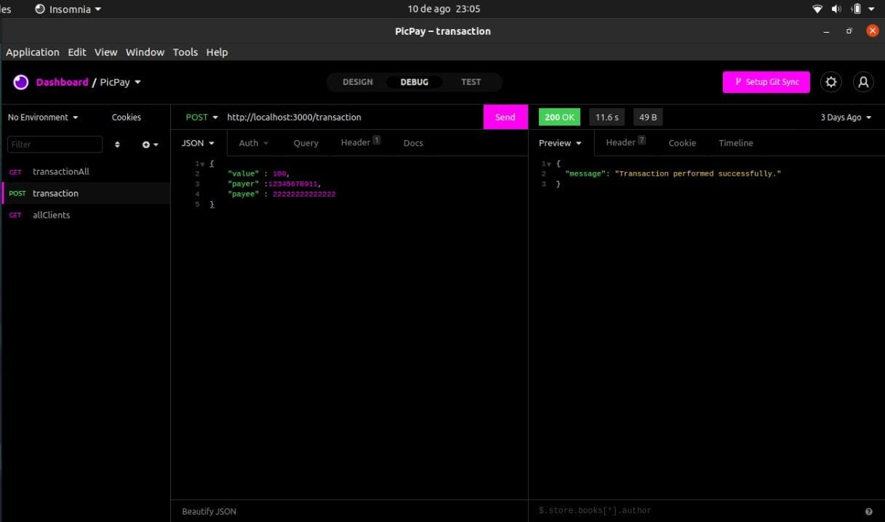
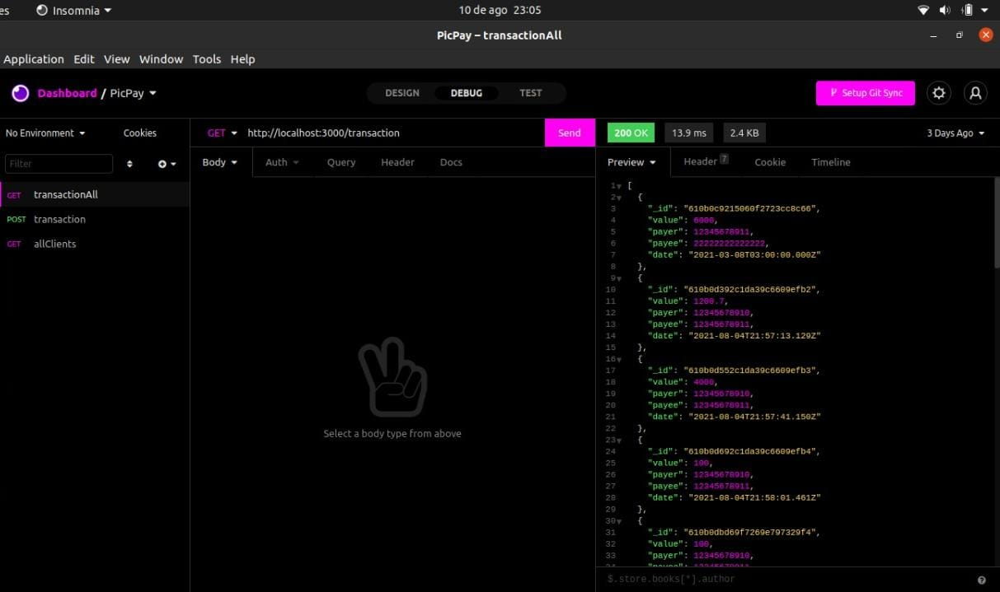

# Bem vindo ao repositório da aplicação Pay Test:

#### O que foi desenvolvido:

Uma aplicação em Node.js que simula transações entre diferentes clientes de um banco fictício, onde clientes do tipo 'PF' (pessoa física) podem realizar transações para outros usuários do tipo 'PF' e do tipo 'PJ' (pessoa jurídica), porem usuários do tipo 'PJ' podem apenas receber transações. A aplicação impede os seguintes casos:
* Transferir uma quantia maior do que ela possui na conta.
* Ficar com o saldo negativo.
* Realizar uma transação pra si mesmo.
* Transferir um valor negativo.

#### Iniciando a aplicação:

1. Clone o repositório.
```
git clone git@github.com:Melissa-gomes/PayTest.git
```

2. Acesse o projeto clonado. 

```
cd PayTest
```

3. Rode o seguinte comando na raiz do projeto para que o Docker seja inicializado.
```
docker-compose build --no-cache && docker-compose up -d && docker exec containerMongo sh -c 'mongorestore ./dump'
```

OBS: Caso não possua o docker instalado na sua maquina, segue aqui o link de documentação e instalação para o docker.  [Documentação e tutorial de instalação](https://docs.docker.com/get-docker/)

Após rodar o comando acima, quando o seu terminal exibir no final uma mensagem parecida com o exemplo a abaixo, significa que o projeto já está pronto e você já pode testar suas funcionalidades.

Exemplo do retorno esperado:
```
2021-08-11T01:38:38.170+0000	34 document(s) restored successfully. 0 document(s) failed to restore.
```


Caso seja necessário, parar e apagar o contêiner docker, rode o seguinte comando.
```
docker-compose down
```

---
#### As Rotas:

A aplicação conta com três rotas:

*GET*: http://localhost:3000/ retorna todos os clientes cadastrados no banco de dados.

*Exemplo de acesso e retorno da rota no aplicativo insomnia rest*




*POST*: http://localhost:3000/transaction rota responsável por realizar a transação entre os usuários e salvar a ação dessa transação em outra collection do banco de dados.

Para que a transação seja realizada é necessário que no campo body da aplicação seja passado um objeto do formato JSON no seguinte formato, mostrado no exemplo abaixo.

```
{
 "value" : 100.90,
 "payer" : 12345678911,
 "payee" : 22222222222222
}
```

Onde o campo `payer` será o CPF do cliente que irá realizar a transação e o campo `payee` será o CPF ou CNPJ do cliente que irá receber a transação 

Obs: Não é necessário usar ponto e barra no objeto nos campos `payer` e `payee`.

*Exemplo de acesso e retorno da rota no aplicativo insomnia rest*



Caso a transação que esteja tentando realizar seja invalida você recebera erros e retornos com mensagens explicando o motivo da transação não ter sido bem sucedida.

*GET*: http://localhost:3000/transaction retorna todas as transações já realizadas entre os clientes.

*Exemplo de acesso e retorno da rota no aplicativo insomnia rest*



---

Ferramentas e Tecnologias usadas:

* Node.js

* express

* Mongodb

* node-fetch

* nodemon

* Docker